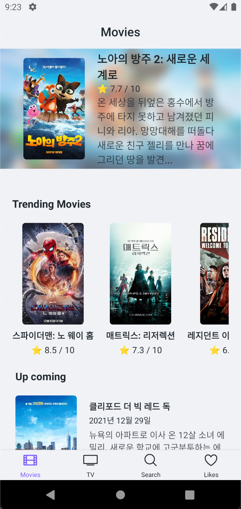
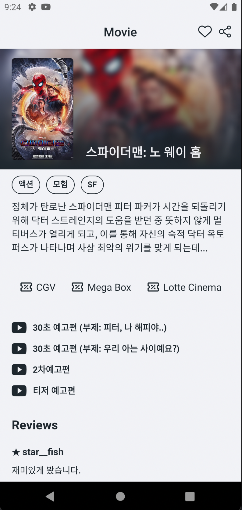
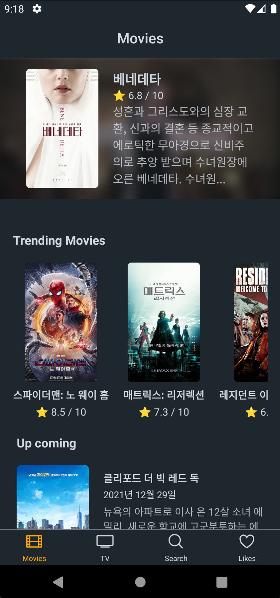
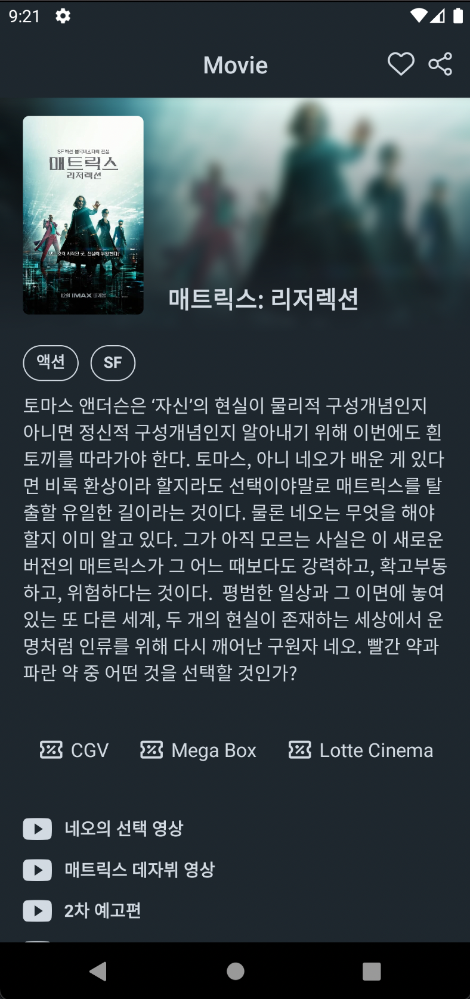
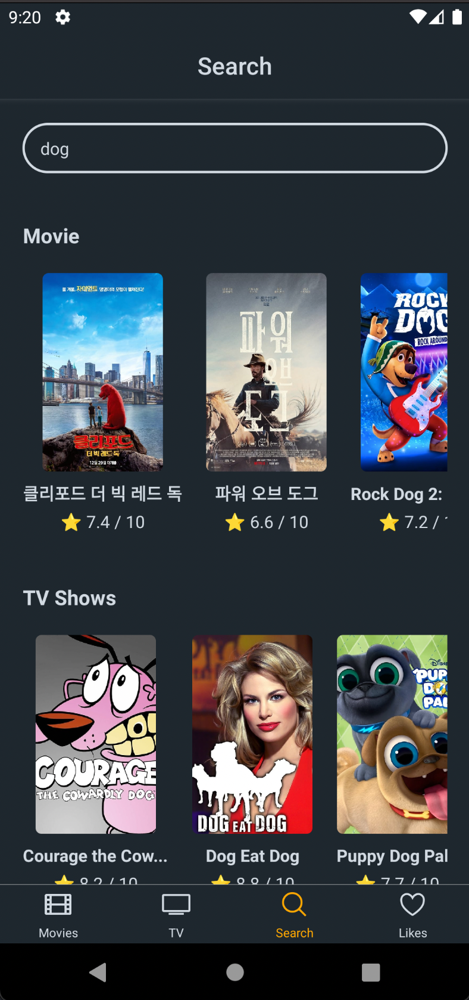

# CAU MOVIT

중앙대학교 소프트웨어보안 실습 repository

## Overview

### Light

### Dark

## SW Requirement Document

요구 사항 등에 대해서 정리한 문서입니다.

→ [요구 사항 문서 📜](./docs/requirements.md)

- 사용자 요구사항
- 시스템 요구사항

## System Modeling Document

시스템 모델에 대한 문서입니다.

→ [시스템 모델 문서 📜](./docs/modeling.md)

- 시스템(컴포넌트) 구조
- 서비스 흐름
  - 사용자 관점
  - 서비스 관점

## System Testing Document

코드 테스트에 대한 문서입니다.

→ [테스팅 문서 📜](./docs/testing.md)

- 동기 테스트 코드
- 비동기 테스트 코드
- 테스트 결과

## System Dependability Report

프로그램(서비스)의 안정성에 대한 문서입니다.

→ [안정성 문서 📜](./docs/dependability.md)

- 보안성
- 신뢰성
- 유지보수성
