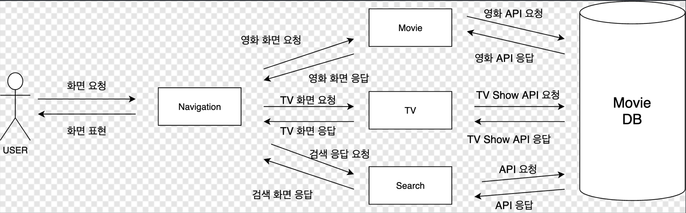
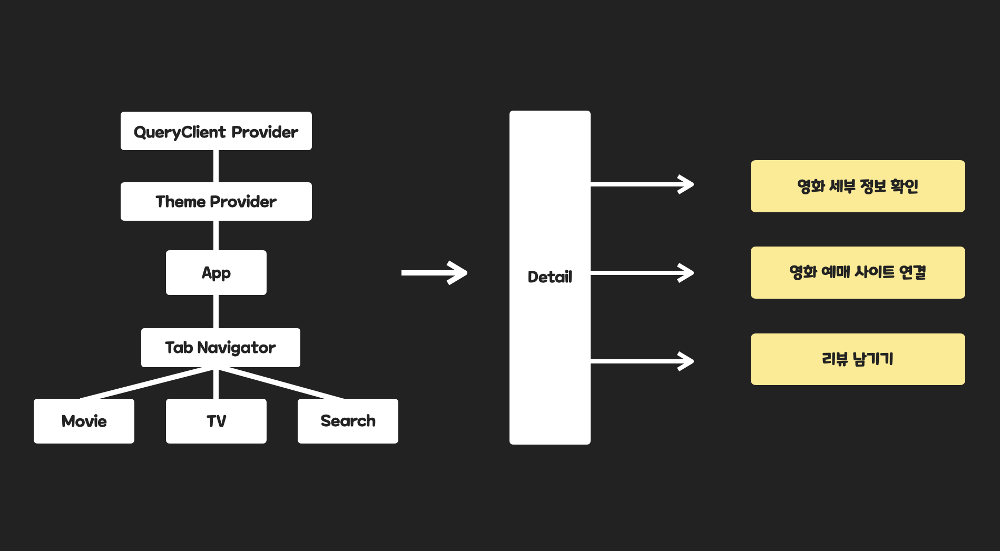

# Modeling

## 1. Service flow

### 사용자 관점

- (1) 서비스에 접근한다.
- (2) 로그인 한다.
- (3-1) 영화/TV Show 등의 컨텐츠 정보를 확인한다. (내부 서비스)
- (3-2) 컨텐츠를 좋아요해서 모아본다. (내부 서비스)
- (3-3) 컨텐츠 검색을 한다. (내부 서비스)
- (3-4) 영화를 예매한다. (외부 서비스)
- (3-5) 영화 예고편, 베스트 컷, 인터뷰 등의 영상을 확인한다. (외부 서비스)
- (3-6) 리뷰를 단다.
- (3-7) 컨텐츠에 대한 세부 사항을 공유할 수 있도록 링크를 공유한다.
- (4) 로그아웃 한다.

## 서비스 관점

- (1) 사용자에게 영화정보 요청을 받는다.
- (1-1) 영화 화면으로 navigate 한 뒤 외부 DB에 API 쿼리를 보낸다. (비동기 처리중 loading 애니메이션)
- (1-2) DB로부터 받은 정보들을 화면에 표시해준다.
- (2) 사용자에게 TV Show 정보 요청을 받는다.
- (2-1) TV Show 화면으로 navigate 한 뒤 외부 DB에 API 쿼리를 보낸다. (비동기 처리중 loading 애니메이션)
- (2-2) DB로부터 받은 정보들을 화면에 표시한다.
- (3) 영화 검색 요청을 받는다.
- (3-1) 사용자가 보낸 쿼리 string을 토대로 DB에서 매칭되는 정보들을 조회하는 쿼리를 보낸다.
- (3-2) 사용자가 보낸 쿼리 응답을 보여준다.
- (4) 컨텐츠 좋아요 버튼을 누른다.
- (4-1) 좋아요한 상태로 컨텐츠의 상태를 바꾼다.
- (4-2) Likes 탭에 이 컨텐츠 정보들을 저장한다.
- (4-3) 사용자가 해당 탭으로 올 경우 좋아요한 컨텐츠들을 표시한다.
- (5) 사용자가 디테일 페이지를 요청한다.
- (5-1) 영화의 경우, 바로 예매할 수 있도록 외부 링크를 제공해준다.
- (5-2) 예고편, 시네마틱 영상 등의 영상을 확인할 수 있도록 연동하는 버튼을 제공한다.
- (5-3) 네이버에서 바로 검색할 수 있도록 네이버 검색 링크를 바로 공유할 수 있도록 해준다.
- (5-4) 사용자가 리뷰를 달 경우 해당 컨텐츠에 해당하는 DB 정보에 리뷰를 추가한다.

## 2. Component Structure

- App 컴포넌트가 모든 탭들을 관리할 수 있도록 한다.
  - Movies
  - TV
  - Search
  - Likes
- 각각의 탭들은 본인만의 상태를 가지고 있다.
- 사용자가 요청한 탭 화면을 렌더링 해주며, 내부 컨텐츠는 외부의 DB로부터 받아온다.

## 3. Structure

